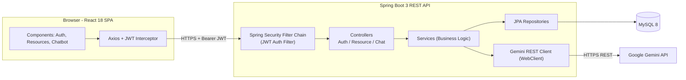
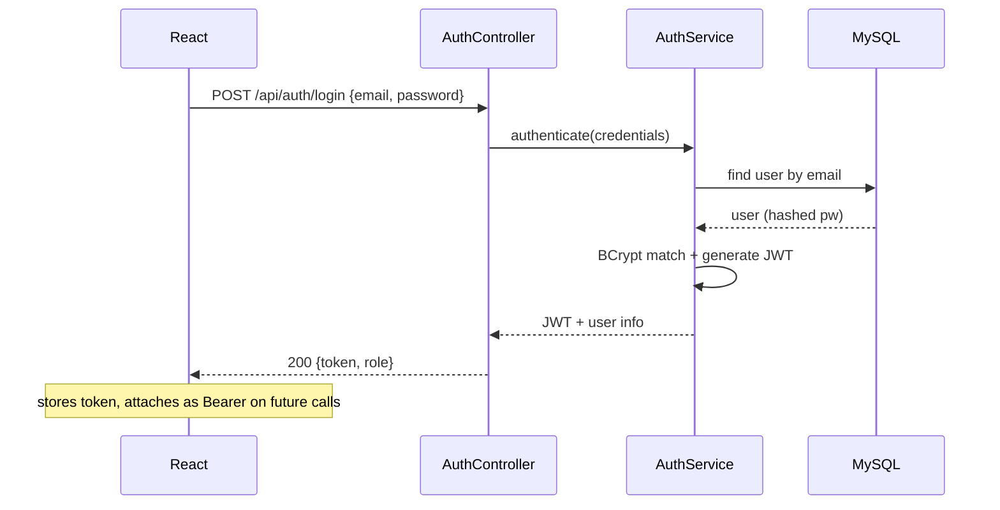
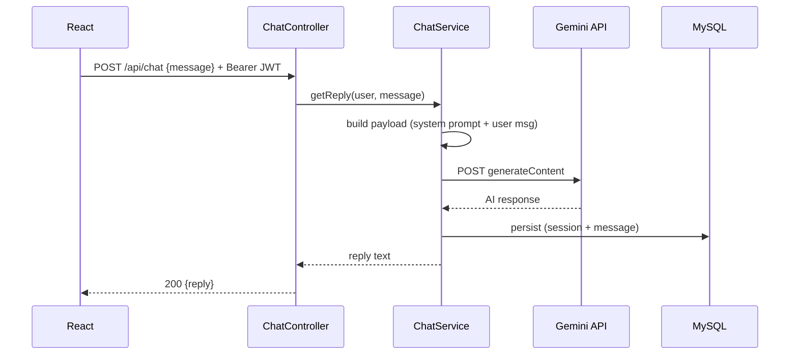

# CampusConnect AI — High-Level Design (HLD)

## 1. System Overview

CampusConnect AI is a 3-tier web application with a server-side AI integration:

1. **Presentation tier** — React 18 SPA (Vite + Tailwind + Axios).
2. **Application tier** — Spring Boot 3 REST API (Spring Web, Spring Data JPA, Spring Security, stateless JWT).
3. **Data tier** — MySQL 8.
4. **External service** — Google Gemini API, called **only** from the backend.

## 2. Architecture Diagram

## 3. Core Modules

| Module | Responsibility |
|---|---|
| **Auth** | Registration, login, JWT issuance/validation, role-based access. |
| **Resource** | CRUD + listing/filtering of academic resources by category/subject. |
| **AI Senior Chatbot** | Pre-prompted Gemini mentor; relays chat to Gemini, returns guidance, persists history. |
| **Security** | Stateless JWT filter, BCrypt hashing, CORS config, global exception handling. |
| **User** | Profile + roles (STUDENT, ADMIN). |

## 4. Key Data Flows

### Authentication (login)

### AI Senior chat

## 5. Security Design

- **Stateless JWT** in `Authorization: Bearer <token>` — no server session.
- **BCrypt** password hashing.
- **Role-based authorization**: `STUDENT` (view/download, chat), `ADMIN` (manage resources).
- **CORS**: explicit allow-list for the React dev origin.
- **Secrets** (JWT secret, Gemini API key, DB password) loaded from **environment variables** — never hardcoded.
- **Global exception handler** → generic client messages, detailed server-side logs.

## 6. Non-Functional Requirements

- **Performance:** non-blocking Gemini calls via WebClient; DB indexes on lookup columns.
- **Security:** Bean Validation on inputs, least-privilege DB user, no secrets in source.
- **Maintainability:** layered architecture; DTOs decouple API from entities.
- **Data lifecycle:** chat history retained for a configurable window, then flushed by a scheduled job.
- **Testability:** services and controllers unit-tested with JUnit 5 + Mockito.

## 7. Deployment View

- **Dev:** React (Vite dev server) ↔ Spring Boot (`:8080`) ↔ local MySQL 8.
- **Config** via `application.yml` + environment variables.
- **Future:** Dockerize backend + frontend; deploy DB as managed service (out of MVP scope).
