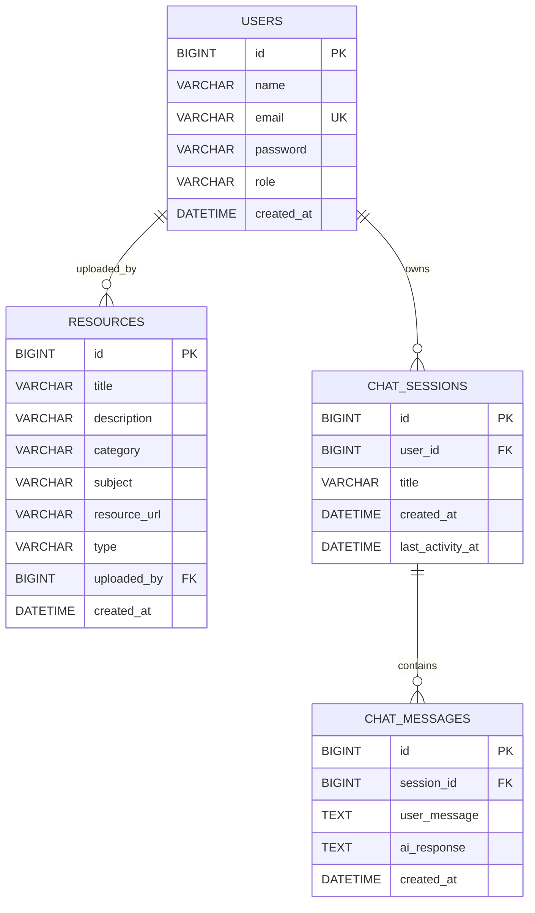

# CampusConnect AI — Low-Level Design (LLD)

## 1. Database Schema (MySQL 8)



**Retention:** A scheduled job deletes chat sessions/messages older than `chat.retention-days` (configurable, default 7).

## 2. Backend Package Structure

```
com.campusconnect
├── CampusConnectApplication.java
├── config/        SecurityConfig, CorsConfig, WebClientConfig, GeminiProperties, DataSeeder
├── controller/    AuthController, ResourceController, ChatController
├── service/       AuthService, ResourceService, ChatService, JwtService, UserDetailsServiceImpl, ChatCleanupService
├── repository/    UserRepository, ResourceRepository, ChatSessionRepository, ChatMessageRepository
├── entity/        User, Role, Resource, ChatSession, ChatMessage
├── dto/           RegisterRequest, LoginRequest, AuthResponse, ResourceDto, ChatRequest, ChatResponse, ErrorResponse
├── security/      JwtAuthenticationFilter, JwtAuthEntryPoint
└── exception/     GlobalExceptionHandler, ResourceNotFoundException, EmailAlreadyExistsException
```

## 3. REST API Contract

| Method | Endpoint | Auth | Body | Response |
|---|---|---|---|---|
| POST | `/api/auth/register` | Public | `{name,email,password}` | `{token, role, name}` |
| POST | `/api/auth/login` | Public | `{email,password}` | `{token, role, name}` |
| GET | `/api/resources` | STUDENT/ADMIN | query: `category,subject` | `[ResourceDto]` |
| GET | `/api/resources/{id}` | STUDENT/ADMIN | — | `ResourceDto` |
| POST | `/api/resources` | ADMIN | `ResourceDto` | `ResourceDto` (201) |
| PUT | `/api/resources/{id}` | ADMIN | `ResourceDto` | `ResourceDto` |
| DELETE | `/api/resources/{id}` | ADMIN | — | `204` |
| POST | `/api/chat` | STUDENT/ADMIN | `{message, sessionId?}` | `{reply, sessionId}` |
| GET | `/api/chat/sessions` | STUDENT/ADMIN | — | `[ChatSession]` |
| GET | `/api/chat/sessions/{id}` | STUDENT/ADMIN | — | `[ChatMessage]` |

**Error shape (all errors):**

```json
{ "timestamp": "...", "status": 404, "error": "Not Found", "message": "Resource not found", "path": "/api/resources/99" }
```

## 4. Key Class Designs

### JwtService
- `generateToken(UserDetails)` / `extractUsername(token)` / `isTokenValid(token, userDetails)`.
- HS256; secret + expiry from config (env vars).

### JwtAuthenticationFilter (`OncePerRequestFilter`)
- Extract Bearer token → validate → populate `SecurityContext`. Skips public endpoints.

### SecurityConfig
- Stateless session policy; CSRF disabled (stateless API).
- Public: `/api/auth/**`. ADMIN-only: write methods on `/api/resources/**`. Authenticated: everything else.
- Beans: `PasswordEncoder` (BCrypt), `AuthenticationManager`, `SecurityFilterChain`, `CorsConfigurationSource`.

### ChatService
- Builds Gemini request: system instruction + user message.
- System prompt: *"You are CampusConnect AI, a helpful and encouraging college senior mentor. You specialize in tech stacks, placement preparation, and core computer science concepts. Give concise, practical, beginner-friendly guidance."*
- Calls Gemini `generateContent` via `WebClient` with timeout; **graceful fallback** message on failure; persists `ChatSession`/`ChatMessage`. Never logs or leaks the API key.

### ResourceService
- CRUD with `Optional` handling → `ResourceNotFoundException` (mapped to 404). DTO ↔ entity mapping.

### ChatCleanupService
- `@Scheduled(cron = ...)` daily; deletes sessions/messages older than retention window.

## 5. Frontend Structure (React 18 + Vite)

```
src/
├── api/axiosClient.js        baseURL + JWT request interceptor + 401 handling
├── context/AuthContext.jsx   token/user state, login/logout, persistence
├── components/               Navbar, ProtectedRoute, ResourceCard, ChatWidget, Spinner
├── pages/                    Login, Register, Dashboard, Resources, AdminResources, Chat
├── App.jsx                   React Router routes
└── main.jsx
```

- **State:** Context API for auth; hooks (`useState`, `useEffect`).
- **Routing:** `react-router-dom`; `ProtectedRoute` guards authenticated pages; admin routes role-gated.
- **Styling:** Tailwind, responsive, modern.
- **Error handling:** Axios interceptor catches 401 → logout/redirect; try-catch around calls with user-friendly messages.

## 6. Configuration & Secrets

- `application.yml`: datasource, JPA, `jwt.secret`, `jwt.expiration`, `gemini.api.key`, `gemini.api.url`, `chat.retention-days` — all via environment variables (e.g. `${JWT_SECRET}`).
- Frontend `.env`: `VITE_API_BASE_URL`.
- `.gitignore` excludes secrets, `node_modules`, `target/`.
- `.env.example` templates committed for both modules.

## 7. Testing Strategy

- **AuthServiceTest** — register (duplicate email), login (bad credentials), token generation. Mockito-mocked repo/encoder.
- **ResourceServiceTest** — CRUD + not-found path.
- **ChatServiceTest** — mocked Gemini client: success + failure/fallback; history persistence.
- **Controller tests** — `@WebMvcTest` + `MockMvc` with mocked services and security.
